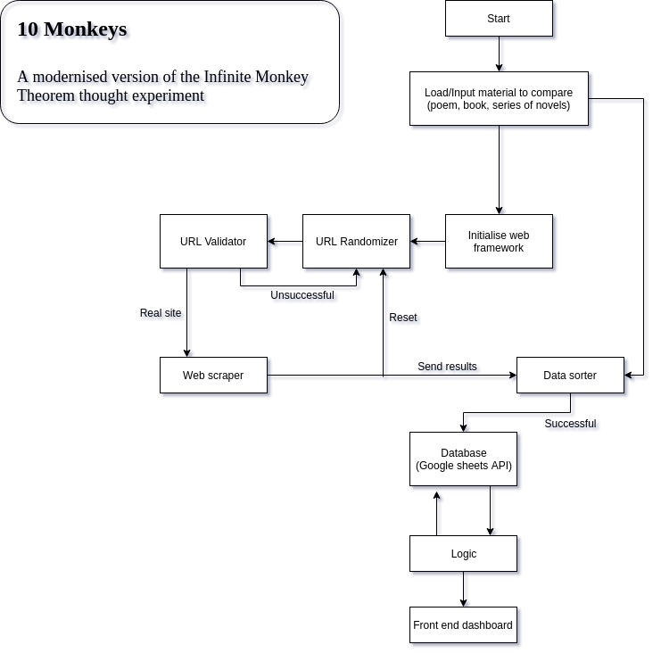

# 10monkeys
> Recreating the [Infinite monkey theorem](https://en.wikipedia.org/wiki/Infinite_monkey_theorem) using Ruby

## Flowchart of the logic

The idea is to host a ruby based web crawler/scraper on a raspberry pi and only running 10 nodes, randomly generate webpages (brute force), scraping non web words and re-create a modern series of novels using only the words found. 

The idea is to see how long the process would take to complete from loading in the novels to be broken down into a readable database to comparing what's been found on the crawl. 

Stats can be generated based on the results, namely;
    
    - How many successful and unsuccessful web hits happened
    - Average number of words per site
    - Average number of words in total with a listing of the top 20
    - Most successful site

There will have to be limitations applied. 
  
    - Strict adherence to the robots.txt rules
    - Any reference to the novels in terms to title name and author will cause the crawler to skip the page
    - Thoughtfulness on the hardware. I'm sure the pi won't be happy with the stress so will have to monitor it and systematically shut it down every now and then.

## Frameworks used

> List frameworks here

Nokigiri

## To use

Installation and usage instructions here

## TODOs

Todo list here

