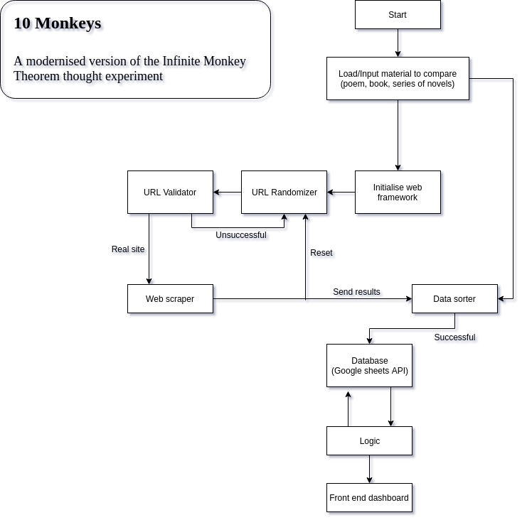

## Flowchart of the logic

Stats can be generated based on the results, namely;
    
    - How many successful and unsuccessful web hits happened
    - Average number of words per site
    - Average number of words in total with a listing of the top 20
    - Most successful site

There will have to be limitations applied. 
  
    - Strict adherence to the [robots.txt](http://www.robotstxt.org/) rules
    - Any reference to the referral material will cause the crawler to skip the page
    - Thoughtfulness on the hardware. I'm sure the pi won't be happy with the stress so will have to monitor it and systematically shut it down every now and then causing an impact on the timing and effectiveness of the tests.

## TODOs

1. Intializer
2. File loader
3. Web framework
4. ~~URL Randomizer~~
5. ~~URL Validator~~
6. Data sorter
7. Integration with Goolge Sheets
8. Data logic comparason 
9. Basic frontend
10. Dashboard
